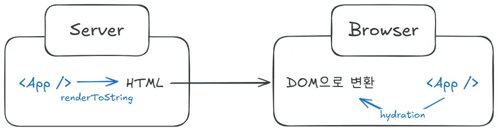
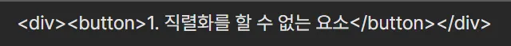
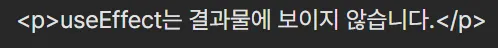
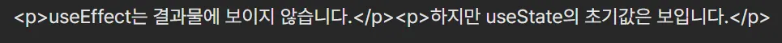
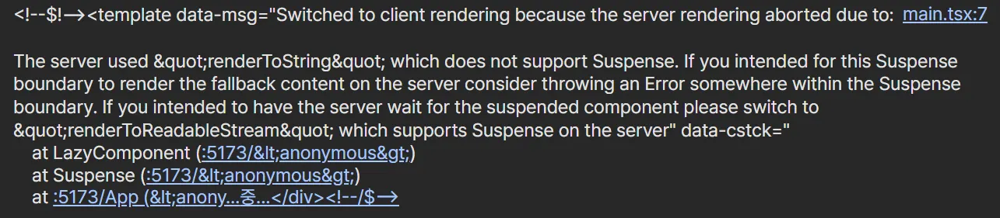

# 📌 renderToString 송곳

## 개요

SSR은 서버에서 완성한 HTML을 브라우저에 전달하고, 브라우저에서 인터렉션 요소를 붙여 앱을 완성하는 방식이다. `<App />`을 SSR로 표시한다고 가정해보자. 같은 App을 전달하지만 서버와 브라우저의 처리 방식은 다르다. 서버는 App을 정적인 HTML 형태로 만든다. 브라우저는 App의 정보를 가지고 이미 정적인 HTML 형태에 상호작용 요소를 추가한다.



리액트에선 SSR을 지원하기 위해 renderToString라는 함수가 있다. renderToString은 서버 입장에서 App을 처리하기 위해 사용하는 함수로, ReactNode로 선언된 App을 string 형태의 HTML으로 만든다. 이렇게만 보면 renderToString이 ReactNode를 전송하게 좋은 형태인 string으로 바꾸는 함수구나~ 하고 넘어갈 수 있다. **하지만 ReactNode의 모든 정보를 HTML로 전송하고 있을까?** 실제로 ReactNode를 renderToString에 넣으면 모든 기능이 HTML로 변환되지 않는다.

그렇다면 renderToString은 string 형태의 HTML을 만들기 위해 App의 정보 중 어떤 것을 거를까?

## 모든 정보를 HTML로 변환하지 않는 이유

어떤 정보를 거르는 지 확인하기 전에 왜 renderToString이 모든 정보를 변환하지 않는지 궁금했다. 그냥 처음부터 모든 정보를 변환하면 되지 않을까?

renderToString이 App의 모든 정보를 변환하지 않는 이유는 다음과 같다.

### 브라우저 환경, DOM이 없어 변환할 수 없다.

App에는 브라우저 환경 중 window를 사용하거나 DOM 요소를 직접 가리켜야 하는 경우가 있다. 예를 들어 timer, alert 등 window 객체의 메서드를 사용할 수 있다. 혹은 어떤 버튼을 눌렀을 때 DOM 요소 중 하나가 사라지거나 내부 요소가 없어질 수 있다. 애초에 어떤 버튼을 눌렀을 때 동작을 시키려면 이벤트 핸들러를 부착해야 하는데, 이조차도 window에 부착한다. 브라우저 환경이나 DOM이 없기에 HTML로 변환할 수 없는 요소가 발생하게 된다.

### 동적인 요소는 브라우저에서 처리하는 게 좋다.

그렇다면 아예 DOM을 서버에서 처리하면 되지 않을까? 서버에서 window와 DOM 요소를 전부 지정해준 뒤 DOM 형태로 전달해주면 되지 않을까?

## renderToString이 거르는 요소

이제 renderToString이 App에서 거르는 요소를 알아보자. renderToString으로 거르는 요소는 아래의 4가지이다.

### 속성 값 중 직렬화를 할 수 없는 요소

renderToString은 직렬화를 할 수 없는 속성값은 HTML로 변환하지 않는다. HTML 태그에는 여러 속성을 전달할 수 있다. 예를 들어 input의 경우엔 value, placeholder, onChange 등 많은 속성이 존재한다. 속성이 다양하 듯 각 속성은 여러 값을 받을 수 있는 데 이 중 함수나 객체의 참조값 등 직렬화를 할 수 없는 경우엔 HTML로 변환하지 않는다.

직렬화란 저장하거나 전송 가능한 형식으로 변환하는 작업을 의미한다. renderToString에서의 직렬화란 string으로 변환할 수 있는 요소를 의미한다. 해당하는 요소엔 boolean, number, string 값이 있고 해당하지 않는 요소엔 함수나 객체의 참조값이 있다. 따라서 어떤 요소의 속성에 함수를 받도록 구현한 경우 그 속성은 반영되지 않는다.

이벤트 핸들러가 대표적으로 직렬화를 할 수 없는 속성 값을 가진 경우다. 이벤트 핸들러를 HTML로 전달하려면 보통 `onclick` 속성을 이용해 콜백 함수를 전달한다. 직렬화를 할 수 없는 함수를 값으로 전달하므로 이벤트 핸들러는 renderToString 결과물에서 사라진다.

```html
<button onClick={() => {}}>1. 직렬화를 할 수 없는 요소</button>
```



### DOM이 필요한 동작

DOM을 필요로 하는 동작의 경우 HTML 요소에 포함되지 않는다. 서버는 DOM을 알지 못하기 때문에 DOM이 필요한 동작은 거른다.

대표적으로 useEffect 등 브라우저의 렌더링 파이프와 관련있는 훅을 예시로 들 수 있다. useEffect는 브라우저 렌더링의 생명 주기와 관련이 있는 훅으로 요소가 모두 DOM에 그려지고 난 이후 useEffect 내 함수가 실행된다. 하지만 서버는 DOM의 상태를 알지 못하므로 useEffect를 HTML에 반영하지 않는다.

```tsx
function App() {
  useEffect(() => {}, []);

  return (
    <>
      <p>useEffect는 결과물에 보이지 않습니다.</p>
    </>
  );
}
```



useEffect라는 훅을 들었기 때문에 헷갈릴 수 있는게, renderToString은 HTML 요소에 포함되는 모든 리액트 훅을 지우지 않는다는 점이다. 훅의 내용 중 직렬화가 가능하고 HTML에 영향을 미칠 수 있는 요소는 반영할 수 있다.

useState의 경우 초기값은 JSX 렌더링 결과에 포함된다. 하지만 초기값을 조정하는 로직은 DOM에 붙여진 이벤트 핸들러의 동작이나 브라우저 렌더링 과정에 영향을 주기 때문에 HTML에 포함되지 않는다.

```tsx
function App() {
  useEffect(() => {}, []);
  const [value, setValue] = useState('하지만 useState의 초기값은 보입니다.');

  return (
    <>
      <p>useEffect는 결과물에 보이지 않습니다.</p>
      <p>{value}</p>
    </>
  );
}
```



### Suspense의 동작

Suspense는 자식 요소가 로드되기 전까지 대체 UI를 보여주는 컴포넌트이다. 하지만 renderToString은 동기적으로 ReactNode를 변환하기 때문에 만약 자식 요소가 비동기적으로 로드될 여지가 있다면 무조건 fallback UI를 반환한다. 이처럼 리액트의 renderToString은 Suspense를 지원하지 않기 때문에 만약 Suspense를 이용한 App을 renderToString으로 감쌀 경우 다음과 같은 오류 메시지가 출력된다.



## 정리

renderToString은 서버에서 App을 HTML 형태의 string으로 변환해주는 함수이다. **하지만 renderToString이 모든 HTML 요소를 string으로 변환해주지 않는다. 이벤트 핸들러, DOM이 필요한 동작, Suspense의 동작은 반환한 HTML 내에 담겨있지 않다.**

서버에선 요소의 DOM을 만들 수 있는 기본적인 구조도를 전달해준다. 이후 이 구조도가 동작하도록 하는 역할은 클라이언트단에서 수행하는데, 이것이 우리가 아는 hydration 과정이다.
